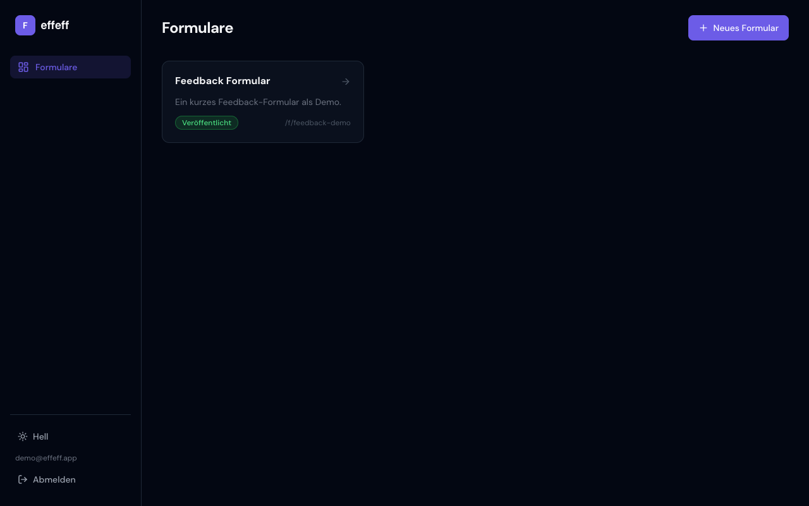
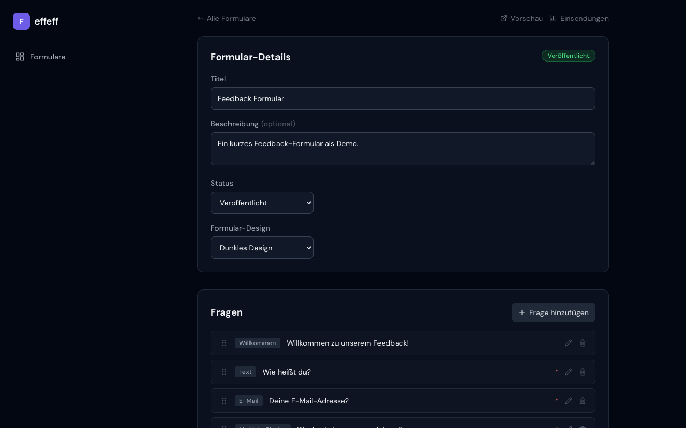
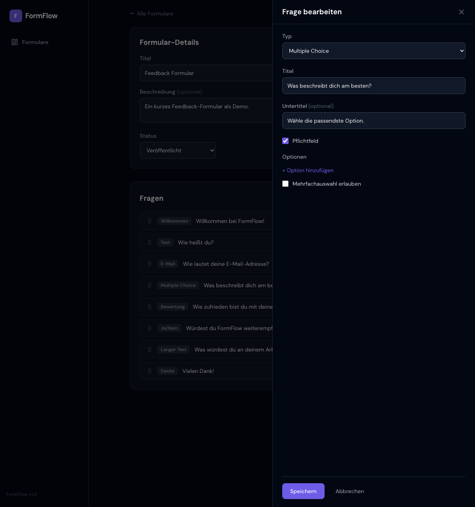
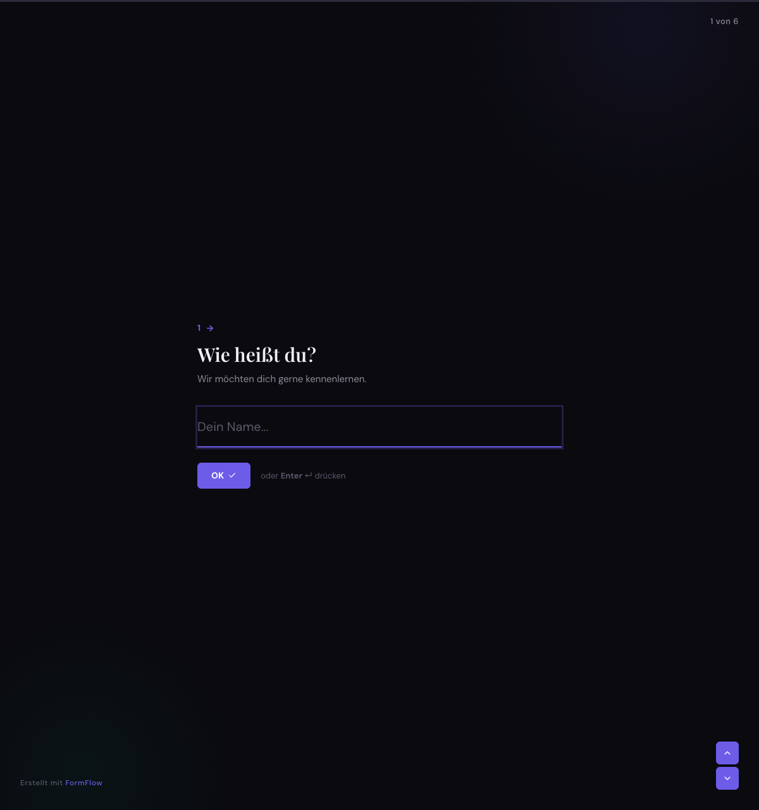
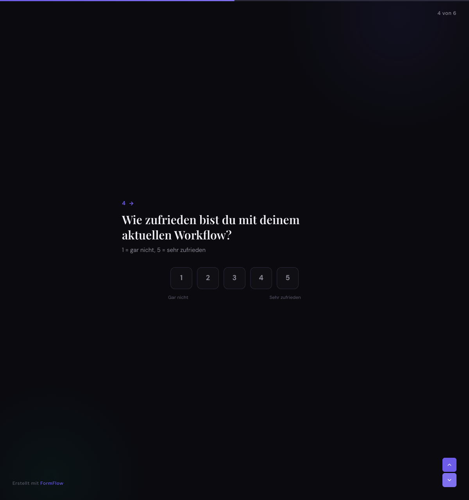

# effeff

A self-hosted Typeform alternative. Create forms, publish them, collect submissions — all on your own infrastructure.

Built with Rails, Go, React, SurrealDB, and Garage (S3-compatible storage).

## Features

- **Drag-and-drop form builder** — reorder questions, configure settings, live preview
- **14 question types** — text, email, multiple choice, rating, yes/no, file upload, and more
- **Animated public form renderer** — full-screen, one-question-at-a-time experience with keyboard navigation
- **Theming** — custom colors, fonts, and branding per form
- **File uploads** — stored in S3-compatible object storage (Garage)
- **Submission analytics** — response counts, completion rates, duration tracking
- **JWT authentication** — protected admin, open public forms
- **Input sanitization** — validated and escaped queries against SurrealDB

## Screenshots

| Admin: Form List | Admin: Form Editor |
|:---:|:---:|
|  |  |

| Admin: Question Editor | Admin: Submissions |
|:---:|:---:|
|  |  |

| Public: Welcome | Public: Text Input |
|:---:|:---:|
|  |  |

| Public: Multiple Choice | Public: Rating |
|:---:|:---:|
|  |  |

## Architecture

```
┌─────────────────┐     ┌──────────────────┐     ┌─────────────┐
│  React Frontend  │────▶│  Rails API       │────▶│  SurrealDB  │
│  :5173           │     │  :3000           │     │  :8000      │
└─────────────────┘     └──────────────────┘     └─────────────┘
        │                       │
        │                 ┌─────┘
        │                 ▼
        │           ┌───────────┐
        │           │  Garage   │
        │           │  :3900    │
        │           └───────────┘
        │                 ▲
        │                 │
        │           ┌──────────────────┐
        └──────────▶│  Go Submissions  │──────────▶ SurrealDB
         (submit)   │  :8080           │
                    └──────────────────┘
```

| Service | Tech | Role |
|---------|------|------|
| **Rails API** | Ruby 3.3, Rails 7.1 | Form/question CRUD, auth, analytics, file proxy |
| **Go Submissions** | Go 1.24, Chi | High-throughput submission writes + file uploads |
| **Frontend** | React 18, Vite, Tailwind | Admin dashboard + public form renderer |
| **SurrealDB** | v2.1 | Document database (HTTP API, no ORM) |
| **Garage** | v2.2 | S3-compatible object storage for file uploads |

The split rationale: Rails handles comfortable CRUD/admin work, Go handles the hot submission path where throughput matters.

## Quick Start

```bash
# 1. Start all services
docker compose up --build

# 2. Import database schema (first run only)
docker compose exec surrealdb /bin/sh -c \
  "curl -X POST 'http://localhost:8000/import' \
    -H 'surreal-ns: effeff' -H 'surreal-db: main' \
    -u 'root:effeff_secret' \
    --data-binary @/docker/schema.surql"

# 3. Open http://localhost:5173
#    Register the first admin account, then start building forms.
```

For file uploads and detailed setup, see [docs/SETUP.md](docs/SETUP.md).

## API Examples

All admin endpoints require `Authorization: Bearer <token>`. Get a token by logging in:

```bash
# Login
curl -X POST http://localhost:3000/api/v1/auth/login \
  -H "Content-Type: application/json" \
  -d '{"email": "admin@example.com", "password": "your-password"}'

# Create a form
curl -X POST http://localhost:3000/api/v1/forms \
  -H "Content-Type: application/json" \
  -H "Authorization: Bearer <token>" \
  -d '{"form": {"title": "Customer Feedback", "description": "Help us improve"}}'

# Add a question
curl -X POST http://localhost:3000/api/v1/forms/FORM_ID/questions \
  -H "Content-Type: application/json" \
  -H "Authorization: Bearer <token>" \
  -d '{"question": {"type": "multiple_choice", "title": "How did you hear about us?", "required": true, "options": [{"key": "A", "label": "Social Media"}, {"key": "B", "label": "Friend"}]}}'

# Submit a form (public, via Go service)
curl -X POST http://localhost:8080/submit/customer-feedback-abc123 \
  -H "Content-Type: application/json" \
  -d '{"answers": [{"question_id": "question:xxx", "value": "A"}], "metadata": {"duration_seconds": 45}}'

# View analytics
curl http://localhost:3000/api/v1/forms/FORM_ID/analytics \
  -H "Authorization: Bearer <token>"
```

## Documentation

- [SETUP.md](docs/SETUP.md) — Local development, Docker setup, environment variables, Garage init
- [ARCHITECTURE.md](docs/ARCHITECTURE.md) — Full API reference, data model, auth, file uploads, question types

## License

Private project.
